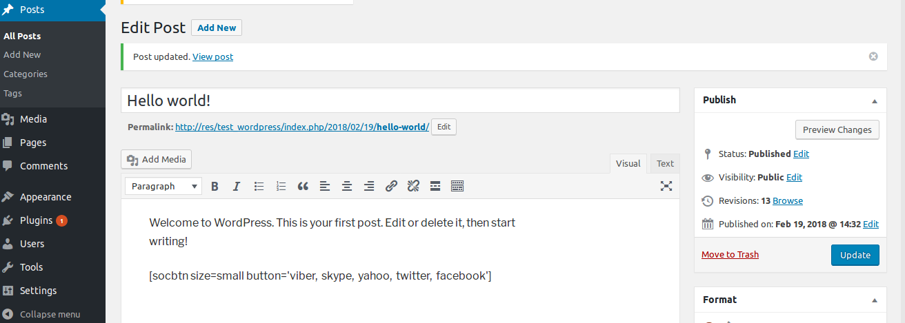
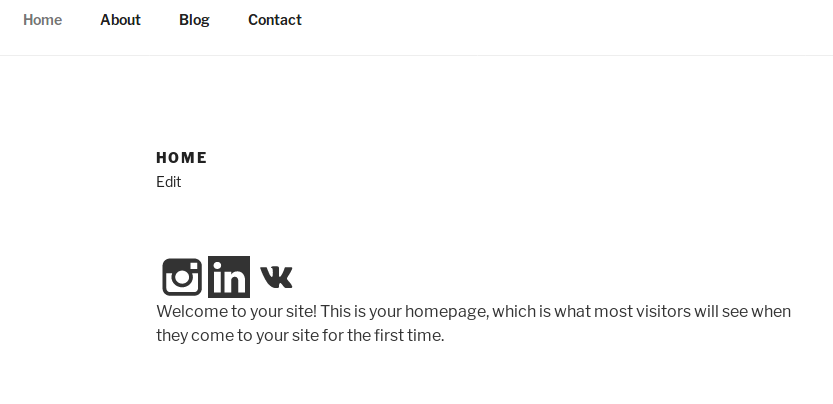
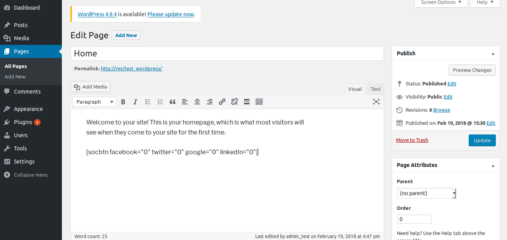

# socbtn-lite
Wordpress plug-in simple social buttons

* Requires at least: 4.9
* Tested up to: 4.9
* Requires PHP: 7.0
* License: GPLv2 or later
* License URI: https://www.gnu.org/licenses/gpl-2.0.html

* Choice of sizes small \ large. Default: large 42px.
* Vertical auto-positioning in the center for sticky left\right modes

## Social networks buttons

* facebook
* twitter
* google
* instagram
* linkedIn
* vk
* pinterest
* tumblr
* livejournal
* viber
* skype
* yahoo

Info about your resource for social networks: 

* title - document.title
* href - URl page
* description - meta tag [description]

## Use the shortcode:

**in the editor:** 
 [socbtn]

**in HTML markup:** 
*       <?php do_shortcode( '[socbtn]' ); ?>

**in the php code:** 
 ob_start(); 
 do_shortcode( '[socbtn]' ); 
 $socbtn = ob_get_clean(); 
 
 
## Position
 align to the left or right edge 
   [socbtn position=left] 
   [socbtn position=right] 

## Size
Setting icon sizes to 24px 
   [socbtn size=small] 
 
## Enabled\Disdabled
By default all the social network buttons are enabled.

* facebook = 1
* twitter = 1
* google = 1
* instagram = 1
* linkedIn = 1
* vk = 1

To hide the buttons of social networks, use the attribute equal to zero. 
[socbtn facebook=0 twitter=0 google=0 linkedIn=0]

## Installation

* Upload the plugin files to the `/wp-content/plugins/socbtn-lite` directory.
* Activate the plugin.

## Screenshot

### 2.2

Added icons: pinterest, tumblr, livejournal, viber, skype, yahoo
